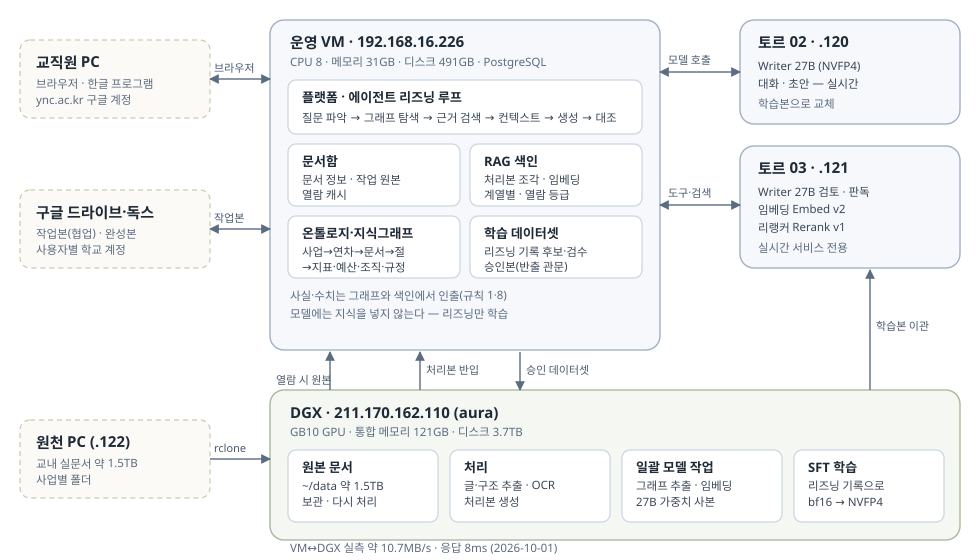

# 인수인계 — 다른 세션/계정이 이어받을 때 먼저 읽는 문서

이 문서는 대화 맥락 없이도 작업을 이어받게 하는 다리다. 순서대로:
`CLAUDE.md`(작업 지침) → 이 문서(현재 상태) → `PROJECT_BRIEF.md`(판단 기준).

문서 점검: 2026-10-01. 날짜별 운영 확인과 로컬 구현 상태를 구분한다.

2026-10-06 후보 게시(C-216): `scripts/sync_generated_candidates.py`는 최신 원문 창의 자동 검사 통과 후보를
기존 Label Studio 검수 프로젝트에 추가한다. 원문 해시·개인정보·수치를 재확인하고 sample_id 중복은 건너뛴다.
기존 태스크·주석은 덮어쓰지 않는다. 현재 원문과 다르면 게시 보류, 수정본의 기존 검수 무효화는 별도 작업이다.
`zzaimy-candidate-publish.timer`는 2분 간격으로 최대100대화를 게시하며 학습 승인은 하지 않는다.
실제 설치·가동 여부는 협업 기록 C-216과 서비스 상태를 확인한다.

2026-10-05 직접 검수(C-213): `scripts/review_candidate.py`로 원문 대조 판정을
`data/training/candidate-reviews/`에 원본 후보 해시와 함께 보존한다. 생성본은 수정하지 않는다.
`candidate_status.py`는 일치하는 최신 판정의 재작성·출처 확인 보류를 candidate 집계에서 분리한다.
후보 내용이 바뀌면 재검수가 필요하다. 이는 검수 작업 목록이며 LS 사람 승인·SFT 반출 관문을 대체하지 않는다.

2026-10-05 생성 집계(C-211): candidate_status.py 추가. 동일 원문 창 재생성은 최신 판만 계수하며
원문 변경 판·의미 중복·현재 DB 유효성·승인 여부는 별도 확인이다. 실측 스냅샷 candidate20대화·51턴,
이전 판34창 제외. 기존 LS101건과 합산하지 않는다. 연속 생성 서비스는 active·재시작0 확인.

2026-10-05 연속 생성(C-210): f77fc9cc까지 정본 푸시·VM 반영, 웹 재시작 없음.
사용자 서비스 zzaimy-candidate-generator.service 등록·enabled/active 확인. MemoryMax 2G, swap 금지,
CPU 1코어 한도·낮은 우선순위, 오류 재시작 60초(1시간 5회 한도). 200창 회차를 반복하며 새 창이 없으면 종료.
의미 검사는 pending으로 별도 보존하고 원문·수치·맥락·개인정보 관문은 유지. LS 게시/학습 승인은 하지 않는다.
상태: systemctl --user status zzaimy-candidate-generator.service, 로그: journalctl --user -u zzaimy-candidate-generator.service.
중지: systemctl --user stop zzaimy-candidate-generator.service. 다시 start하면 저장한 창을 건너뛰어 재개한다.

2026-10-05 반복 검증(C-209): v5 20창 완료, 11대화·28턴 생성, 자동 검사 통과 9대화·23턴.
표본에서 OCR 불명 문구와 범위 밖 정산자료 발견. 별도 모델 의미 검사 및 JSON 응답 제한을 추가한
v6 20창 검증 시작. 같은 모델의 의미 검사는 doc591 오류를 놓쳤으므로 독립 검수/승인으로 간주하지 않는다.
관련 회귀 91건 통과. 문서 분류 목록도 갱신 중이므로 이전 배치와 엄밀한 동일 표본 성능 비교가 아니다.

2026-10-05 보류 개선(C-208): 학습용 근거 사본 생성 전 개인정보 보호, 원문 해시로 승인 시 재대조,
2~6턴 연결 대화 허용, 구체적 검사 피드백으로 최대 1회 수정·재검사 구현. 관련 검사 90건 통과.
기존 20창 배치는 14대화·43턴 생성 중 4대화·13턴 자동 검사 통과. 나머지는 보류/오류로 유지.
개선판 실문서 비교 중이며 LS 게시·학습 승인은 별도다. 사업 오분류 검수는 Claude에 C-208로 요청.

2026-10-05 재개(C-206·207): VM 재기동 후 SSH·내부 모델 연결 복구 확인, RAM 62Gi·swap 사용 0.
이전 장애 중 생성 파일은 없었으며 복구 후 시험부터 집계한다. 첫 3창에서 3대화·9턴 생성,
2대화·6턴 수치 근거 문제 보류. 보강판 추가 3창은 2대화·6턴 생성·5턴 보류, 1창 범위 미확인.
후속 질문은 직전 부모와 연결한 3~6턴 단위이며 자동 검사 통과도 의미 검수 승인이 아니다.
20창 추가 생성·검사를 메모리 상한 2G·내부 review 모델 순차 요청으로 시작했다.
산출물은 data/training/generated-candidates에 창별 저장한다. LS 게시·SFT 학습 실행은 하지 않았다.
아래 10/4 접속 차단 기록은 과거 상태다. Claude의 메모리 부족 원인·조치는 K-20261005-01 참조.

2026-10-04 페이지 이동(C-203): _dev_data_view 기본 화면에서 legacy 전용 preview_sources·rag_status·LS 조회 생략.
숨겨진 데이터 준비에 전체 문서 및 문서별 조각을 순회하던 병목 제거. 회귀 32건 통과, 운영 배포 미실시.
legacy 화면 자체의 전체 순회는 여전히 남아 있으며 별도 페이지네이션/비동기 전환이 필요하다.

2026-10-04 배치 생성(C-202): 원문 창별 재개 가능한 후보 생성기 추가, 관련 검사 67건 통과.
교내 모델 3창 실행을 시작했으나 이후 VM SSH banner timeout으로 완료 여부 미확인.
복구 후 data/training/generated-candidates/*.json의 상태·근거를 먼저 확인할 것.
배치 후보는 아직 LS에 게시하지 않았으며 지속 실행 확대·의미 검수도 남아 있다.

2026-10-04 추가 생성(C-201): LS project5 최신 후보 101건·사람 주석 0건.
doc579(LINC3.0 첫 연차평가)·903(LINC+ 첫 연차평가)·649(대구 RISE 예산 심의)에서
각 12건, 총 36건 게시. 후속 6건은 부모 대화 보존. 원문 조각·수치·개인정보·맥락 검사 보류 0건.
관리 필드 백업: data/training/workspace-backups/20261004-232519-345664, 삭제 0건.
후보와 원문은 data/training/authored-qa-*에 보존하며 Git에는 넣지 않는다. 독립 검수·SFT 승인은 미완료.
문서 목록의 연차와 원문이 다른 사례가 있으므로 원문 표제 기준으로 작성했으며 분류 변경 검수는 별도다.

2026-10-04 후속 대화 개정(C-200): LS task450/451을 부모·후속 동시 수정하고 history 재생성.
현재 최신 후보 65건 유지. 관련 검사 52개 통과, 승인 아님. 분류 snapshot/core_docs 생성은 확인했으나
변경 기록은 비어 있어 분류 변경→문답 재검수 자동 연결은 아직 미완료다.

2026-10-04 문답 후속(C-199): LS 공고 문답 3건 revision 2로 보강, LINC3.0 평가 문답 3건 추가.
project5 후보 65건·사람 주석 0건. 답변 변경 시 옛 AI 검수를 무효화하며 원문·수치·개인정보
검사 후 후보로 반영한다. 원본 렌더·독립 검수·SFT 승인은 미완료. 관련 회귀 50개 통과.

2026-10-04 LS 최신본 정리: 프로젝트 5의 구버전 7건을 백업 후 제거, 현재 후보 62건.
복구 백업 경로와 ID는 C-198 참조. 주석은 0건이며 관리 상태는 SFT 승인이 아니다.
개발 현황 디자인·연결 상태 조회 병렬화는 로컬 변경(운영 미배포). 관련 검사 31개 통과.

2026-10-04 프로젝트 검색 UI(로컬): `/projects/archived`에서 상태·사업단·수행 연도별 검색,
지침·기준의 `for_project` 진입과 참조 연결을 제공한다. 원본 소속·보관 상태를 유지한다.
대상 프로젝트 소유권·참조 문서 열람 권한 검사 및 #paneRefs 탭 이동을 보완했다.
Python 22개·Node 2개 검사 통과. 운영 배포 미실시. 상세 C-196.
10/3 아래 출처 이관 대기 기록은 Claude의 K-20261004-01 배포 보고로 갱신된다.
실제 사업 수행 연도와 병합 정확도 독립 검수는 아직 남아 있다.

2026-10-03 보관 프로젝트 안전 수정(로컬): 자동 묶음은 `projects.archive_source=dgx`로 구분한다.
활성 사용자 프로젝트 재사용·수동 보관 묶음 삭제를 방지한다. 기존 프로젝트 출처 이관은 미실시이며
운영 반영 전 생성 이력 대조가 필요하다. 보관 자료 검색·참조 연결은 보관 해제/소유권 이전과 별개다.
관련 프로젝트의 지침·기준 탭 연결 및 연도·세부 사업 묶음 검수는 남아 있다(C-191~193).

2026-10-02 원본 동기화 검수: C-181에서 7개 결함 재현, C-182에서 이동 후보 모호성·
후속 문서 ID 연결 누락을 로컬 보완했다. 잠금·색인/그래프 실패 재시도·dry 쓰기·개인 첨부
목록 가시성은 미해결이다. 상세는 `notes/2026-10-02-document-sync-review.md` 참조.

2026-10-02 로컬 변경: 채팅 status API에 실행 단계·경과 시간 정보를 추가했다.
작업 내역 버튼으로 실제 단계 목록을 펼친다. 내부 추론 원문은 노출하지 않는다.
운영 배포는 미실행이며 검증 범위는 collaboration/codex.md C-176 참조.

그래프 화면은 `/graph/explore`(ADR-0054)이며 문서·절·성과지표 노드를 열람 권한으로 거른다. 옛 `/graph`·`/graph.json`·
`/graph/evidence`는 10/6 없앴다(데이터 열람의 문서 연관은 같은 권한 규칙의 build_graph 를 그대로 쓴다).
별도 사업 화면 `/graph/program`도 허용 문서·절과 그 상위 분류만 표시한다(C-180).
관계와 건수는 양쪽 문서가 허용된 범위에서 계산하고, 접근할 수 없는 사업 선택은 404로 응답한다.
운영 배포 전까지 기존 API의 권한 누락이 해소된 것으로 보지 않는다.

일반 채팅 응답기의 옛 공개 코퍼스 조회 분기를 제거했다(C-179, 로컬 변경).
현재 등록 문서 검색과 선택 기준 문서 경로는 유지하며 과거 데이터 파일은 삭제하지 않았다.

---

## 1. 지금 어떤 구성으로 도는가

2026-10-01: DGX 실문서 수령·처리와 사업별 그래프 구축 진행 중. Claude 기록의
AID·LINC3.0 파일럿은 16문서이며 전량 수신/검수 완료를 의미하지 않는다.
사업별로 독립 분석하고 근거가 확인된 관계만 연결한다. 전체 최신 건수는 운영 대장으로 확인한다.
CoT 맥락·근거 선택 검사, 문서 검토 요약 및 채팅 링크 개선은 Codex 로컬 변경 상태이며
배포 완료로 해석하지 않는다. 상세: collaboration/codex.md C-159~166.

2026-09-30 정리 당시 데이터 범위(사용자 명시): 운영 문서 ID557,560~565(프로젝트4)의 실문서 7개만 유지.
ID566~576 교내 규정 11건 및 파생 검색 자료/파일 대장은 제외. 디스크 원문은 보존.
별도 공개 코퍼스는 운영 경로에서 backup/real-docs-only-20260930/corpus_pilot로 이동했다.
같은 폴더의 platform.dump(PostgreSQL), corpus-snapshot.db(SQLite 무결성 확인)가 복구본이다.
임의로 옛 규정/코퍼스를 다시 반입하지 않는다. 새 문서는 사용자 반입 범위를 따른다.

2026-09-29 개발 화면·개인정보 정책(ADR-0044): 내부 반입·첨부·응답 마스킹은 기본 꺼짐.
`/dev/pii`에서 전체·항목별 설정을 저장하며 이후 처리에 적용한다. 기존 가림 본문은
자동 복원하지 않는다. 문서 접근 권한은 유지하며 학습 사본은 별도 개인정보 검사와
검수 승인이 필요하다. JSONL 개별 다운로드·묶음 반출은 품질 관문 통과 파일만 허용한다.
`/dev/data`는 `/dev/train`으로 이동한다. 9/30부터 검수·승인 산출물·학습/평가는
데이터·학습 한 페이지이며 연결 설정은 별도 도구·모델 연결 화면이다.
`/dev/docs`는 현재 자료·설계 결정·실험 이력으로 나뉜다. 아래 과거 현황표보다 이 변경을 우선한다.

2026-09-29 외부 참조 정리: 기존 API 전송·승인·재시도 UI/실행 경로 제거(ADR-0043).
과거 DB 기록은 보존. 웹 검색과 구독 인증 상태 확인은 유지하며, 구독 로그인 시작과
작업 세션 실행은 아직 미구현이다. f132272d 운영 배포 완료, 검증 범위는 collaboration/codex.md C-144 참조.

2026-09-29 DB 변경: 플랫폼 운영 DB는 PostgreSQL 14, DB `aura_platform`, 스키마
`aura_app_c129_live`(VM 로컬 UNIX socket/peer 인증). `.env.local`의 DB 키를
`database_backend.connect`가 서비스·CLI 공통으로 읽는다. 별도 코퍼스는 SQLite 유지.
`data/platform/platform.db`는 이제 구형 직접 연결을 막는 안내 파일이며 SQLite DB가 아니다.
옛 DB는 `platform.retired-c129.sqlite3`, 최종 스냅샷·환경 백업·대조 결과는
`data/platform/backup/pg-final-c129/`. 새 쓰기는 PG에만 있으므로 SQLite로 단순 복귀 금지.
구형 작업 스크립트의 sqlite3.connect는 backend.connect로 옮긴 뒤 사용한다.

원본 문서·처리·일괄 모델 작업·SFT 학습은 DGX, 서비스 데이터(문서함·RAG 색인·온톨로지·학습 데이터셋)는 운영 VM, 실시간 모델은
토르 02·03(ADR-0047). 그림은 개발 허브의 프로젝트 현황에도 같은 파일로 나온다.

### 역할 분담

토르 02는 대화와 초안 작성처럼 사람이 기다리는 일을 맡고, 토르 03은 반입 검토와 이미지 판독 같은
배치 작업과 임베딩·리랭커 서비스를 맡는다. 같은 27B 모델을 두 대에 각각 올려 배치가 대화를 막지
않게 했다. DGX는 실문서 원본 보관, 원본 처리, 일괄 모델 작업, 학습을 한다(실시간 서비스는 하지 않는다). 계획에 없는 모델은 쓰지 않는다. 9월 21일에 계획 밖 소형 판독
모델을 지웠다.

LLM 연결은 화면(개발자 > 연결)에서 등록한 값이 우선이며 `data/platform/llm_connections.json`에
저장된다. 지금 연결은 토르 02의 Writer(answer, 기본 연결)와 토르 03의 Writer(review, vision) 둘뿐이다.
스크립트에서 연결을 쓰려면 `llm_connections.configure(...)`를 부른다. 공개 수집 문서만 외부 상용
모델로 읽는 용도(`vision_public`)가 따로 있고 키는 화면에서 넣는다. 지정하지 않으면 판독 모델을
쓴다(ADR-0024).

### 젯슨 토르

`thor-02@211.170.162.120`과 `thor-03@211.170.162.121`, SSH 포트 8022다. 맥의 키가 등록돼 있고 sudo는
비밀번호가 필요하다. Jetson AGX Thor로 통합 메모리 122GB. 모델 파일은 `~/zzaimy/models/`, 서비스
코드는 `~/zzaimy/serve/`에 있다.

Writer 서빙은 `scripts/126_serve_writer.sh` 하나로 한다(HOST, MODEL, IMAGE, PORT 인자). 두 대 모두
`MODEL=/models/Qwen3.8-27B-NVFP4`, `IMAGE=ghcr.io/nvidia-ai-iot/vllm:qwen3.8-next-jetson-thor-latest`
다. 9월 22일 토르 02까지 교체를 마쳤고 요청 하나에 초당 10.9토큰이 나온다(원본 bf16은 2.4~4.5).
양자화 판은 기본 젯슨 빌드(gemma4 태그, vLLM 0.19)에서 뜨지 않으므로 반드시 Qwen3.8 전용 태그를
쓴다. 학습본은 `116_ship_and_serve.sh writer`로 두 대에 올린다.

젯슨의 GPU 메모리 함정이 둘 있다. 큰 파일을 받은 뒤에는 페이지 캐시가 GPU 메모리를 막아 vLLM이
cuBLAS 오류로 죽으므로 root로 `sync; sysctl vm.drop_caches=3`을 한 뒤 서빙을 올린다. 컨테이너를
`docker rm -f`로 죽이면 GPU 메모리 88GB가 돌아오지 않아 재부팅이 필요했으므로 126은 `docker stop
-t 60`으로 정상 종료를 기다린다. 확인은 `torch.cuda.mem_get_info()`로 한다.

토르의 Ollama(0.32.6, 포트 11434)는 9월 21일부터 용도에서 빠졌다. 그 위의 `zzaimy-answer`와
`zzaimy-review` 모델은 서빙 실험의 흔적이다. 운영 서버에서 토르 02로 가는 길은 첫 구간 장비의
허용 목록 누락으로 막혀 있다가 9월 20일 사용자가 풀었다.

임베딩 재계산은 토르 GPU로 한다. 맥에서 `bash scripts/96_embed_on_thor.sh --apply`를 실행하면
조각 4천 개가 1분 안에 끝나고, 운영 서버 CPU 표본과 코사인 1.00000으로 맞았다. 운영 서버 CPU
경로(`66_reindex.sh`)는 한 시간 넘게 걸린다.

### DGX

2026-10-06 원본 보관소 화면(C-218): 보관 파일·문서함 연결·미연결·연결률을 대장 기준으로
구분한다(분석 완료율 아님). 원본 검색 결과의 원본 열기는 기존 읽기 전용 rsync 키로 파일
한 개만 임시 전송한다. 최대 100 MB·45초·프로세스당 동시 2건, 대장 크기/수정 시각 검증,
응답 후 임시 파일 정리. PDF·이미지는 열람, 나머지는 다운로드. 연결 문서는 기존 열람 권한,
미연결 파일은 개발자만 허용한다. 플랫폼 업로드 원본은 기존 문서 화면에서 연다.
원본 다운로드 기능의 운영 반영에는 웹 프로세스 재시작이 필요하다.

`ssh -p 8022 aura@211.170.162.110`으로 접속한다(2026-10-01 이전: 우리 작업 전용 aura 계정 — sudo·docker 그룹, 맥 키 등록. dgx-01 은
여러 사람이 함께 쓰는 계정이라 우리 것(`~/zzaimy-capstone`·`~/zzaimy`)을 aura 로 옮겼다. 실문서 원본은 `~/data/`(사업별 폴더, rclone).
호스트 이름 spark-b30a, GB10, aarch64, 통합 메모리 121GB, Ubuntu 24.04, 디스크 3.0TB 여유, docker 29와
python 3.12가 있다. 같은 장비에 Ollama가 상주하며 27b, 35b, 120b 모델로 메모리 93GB를 잡고
있으므로 학습 전에는 그 모델들을 내려야 한다(`keep_alive` 0 또는 서비스 중지, sudo). 사용 금지인
옛 Spark(.109)와는 다른 장비다. 9월 21일 오후에 잠시 서빙을 넘겼다가 토르 03으로 복귀하며 연결을
지웠다. 학습본 이관 경로는 ADR-0023 3절(bf16 병합, NVFP4 양자화, 116으로 두 토르)이다.

학습 환경(2026-09-22 설치): `~/zzaimy-capstone`(깃 체크아웃) 안의 `.venv-train` — `configs/training-env.txt` 고정
스택(torch 2.13.0+cu130, transformers 5.6, peft 0.18, trl 0.24, sentence-transformers 6.0, llamafactory 0.9.5)을
그대로 설치했고 GB10 에서 bf16 행렬곱까지 확인했다. bitsandbytes 는 없다(aarch64 CUDA 13 휠 없음) — Writer 학습은
bf16 LoRA 가 기본이고 `scripts/83 --4bit` 는 휠이 생기면 쓴다. 베이스 가중치는 `~/zzaimy/models/Qwen3.8-27B`(토르 02 에서
rsync). 학습 전에는 Ollama 모델을 내린다: `curl -s localhost:11434/api/generate -d '{"model":"qwen3.8:27b","keep_alive":0}'`
(35b·120b 도 같이) — 내리면 CUDA 가용 91GB. 장비 검증은 `env PYTHONPATH=src .venv-train/bin/python scripts/83_sft_writer_qlora.py
--base ~/zzaimy/models/Qwen3.8-27B --smoke`(합성 4쌍 2스텝, 9월 22일 통과: 최고 메모리 52.7GB, 모델은 전부 GPU 에
올린다 — device_map auto 는 층을 meta 로 내려 역전파가 실패했다). 도커는 aura 계정이 docker 그룹이라 쓸 수 있다.

원본 보관소와 VM 갱신(2026-10-02): 원본은 DGX `~/data`(rclone 으로 계속 들어온다, 10/2 기준 125,012건·789GB). VM 이 읽기 전용으로만
본다 — DGX aura 의 `authorized_keys` 에 VM 전용 키(`vm-dgx-readonly`, VM `~/.ssh/id_ed25519_dgx_ro`)를
`command="/usr/bin/rrsync -ro /home/aura/data",restrict` 로 등록(명령 실행·쓰기 거절 확인). 되돌리기는 그 줄 삭제.
VM cron(aura) 네 주기, 모두 `scripts/170_vm_sync.py`, 기록 `/tmp/zz_sync.log`, 주기별 마지막 실행은 `data/platform/sync_status.json`
(개발 현황 「반입 현황」 탭·`/dev/api/intake`):
- 10분 `zz_sync.sh`(flock /tmp/zz_sync.lock): rsync 목록 → 원본 목록 장부(`archive_files`, 차이만: 새로·바뀜·옮김·없어짐, 화면 `/archive`)
  → 사업 분류(규칙 + 폴더 검토 장부 `class_review.jsonl`) → 문서함 DGX 보관 프로젝트를 장부 분류에 맞춤 → 새 뼈대만 받아 `164`
  (사업별 반입, 분석은 토르 02 `ZZAIMY_ROLE_CONN`) → 그래프 `157 --full`·사업별 공통 양식 `162` + docx.
- 5분 `zz_parsed.sh`(170 --parsed): DGX `~/parsed` 결과를 읽기 전용 키로 받아 `168` 로 들인다. 들이기 전용 잠금(/tmp/zz_parsed_import*.lock),
  경로마다 문서 하나(DB 부분 고유 색인 `ux_documents_dgx_path`), 원본 장부의 현재 판과 같은 기록만 적용.
- 2분 `zz_index.sh`(170 --index): 사업 문서 색인(`knowledge/index/grant_embeddings.npz`, ADR-0049)만 따라잡기 — 그래프 재구축과 따로.
  토르 임베딩, 묶음 제한 90초·실패 시 반으로 나눠 다시. 실측 초당 20~26조각. 같은 주기에서 어휘 색인(`grant_lex`, 조각별 Kiwi 명사 +
  PostgreSQL GIN)도 채운다 — 사업 문서 검색은 이 색인이 95% 넘게 차면 후보 조각만 읽는다(`grant_search`·`grant_lex`, 10/5).
- 크론 넷은 `scripts/zz_run.sh` 로 돈다: 메모리 상한(sync·quick 24G, index 16G, parsed 12G)과 강제 종료 우선순위(웹·DB 보다 먼저).
  10/4 밤 색인 갱신·그래프 작업이 겹쳐 VM 이 메모리 부족으로 멈췄다(그 뒤 VM 64GB). 무거운 일회성 작업도 이 실행기로, 한 번에 하나.
  운영 보조 스크립트는 `~/ops`(/tmp 는 재부팅 때 비워진다).
- 1분 `zz_quick.sh`(170 --quick, `.kg-dirty` 있을 때): 업로드 원본 DGX 올리기 → 그래프·양식(15분에 한 번까지, /tmp/zz_post.lock).
원본 전체의 가벼운 처리(글·조각, 검토 의견 없음)는 DGX `.venv-parse`(파싱 전용 가상환경: torch 2.13+cu130 고정, mineru 3.4.5, docling 2.126.0 — docling 은 오피스 구조 읽기만)에서
`scripts/167` → VM `scripts/168`('DGX 보관 문서', stored_path `dgx://`). 167 은 MinerU 동시 실행 상한(`ZZAIMY_MINERU_SLOTS`, 기본 2)과
가용 메모리 하한(`ZZAIMY_MIN_FREE_GB`, 기본 24)을 지킨다 — DGX 는 공용 장비(Ollama 상주 약 67GB)라 작업자마다 MinerU 가 뜨면 121GB 를
다 써 SSH 가 멎는다(2026-10-02 실측). 스캔 PDF 판독은 MinerU(docling 은 스캔 경로에서 뺌, `docs/ocr-duel.md` 2026-10-02 대결).
과거 사업 묶음과 프로젝트(2026-10-03~04): 동기화가 문서를 보고 묶는 과거 사업은 「보관」 프로젝트(projects.archived=1,
archive_source='dgx', program=「사업 id|연도」)로 사업 × 수행 연도마다 하나 — 사이드바·라이브러리·프로젝트 검색에 안 뜨고 「보관된 사업」
(/projects/archived, JSON /api/projects/browse)에서 찾아 불러온다. 「사업 아님」 판정은 「기관 일반 업무」, 모르는 것은 「사업 미분류 (검토 대기)」.
담당자 프로젝트에는 사업단(projects.unit, 선택지는 원본 최상위 폴더)이 있고, 만들 때 이름이 겹치는 보관 사업이 참조(project_refs)로 붙으며
프로젝트 대화의 사업 문서 검색은 참조 묶음 문서부터 본다. 연도 근거: 파일 이름 → 가장 깊은 폴더 → 본문 첫머리 800자, 외부 확인 장부의
사업 기간으로 연차↔연도 환산·기간 밖이면 기간이 맞는 앞뒤 단계 사업으로(programs.fill_period·ledger_link). 분류 규칙을 고친 뒤 바로 반영은
`170 --ledger-only`. 그래프 전체 재구축은 약 22분(묶어 읽기·쓰기), 끝날 때마다 data/platform/doc_program_changes.jsonl(배정 변경)·
program_core_docs.json(사업 × 연도 확정 핵심 문서)을 낸다.
사업 체계(일반재정지원·앵커·특수목적, 앵커 편입 연도)는 외부 검색으로 확인한 장부 VM `data/platform/kg_external.json`
(출처 필수)로 그래프에 들어간다 — 사업 정식 이름(name, 그래프 표시 이름)·기간·전신(predecessor)·편입(integrated_into)·분류
(일반재정지원·RISE·앵커·특수목적·타부처·「사업 아님」). 공통 양식은 문서 갈래별(`scripts/172`: 연차 사업계획서·연차 실적보고서·
프로그램 운영계획서·프로그램 결과보고서 — 사업 셋 이상에 공통인 절·표)이 드라이브 「ZZAIMY/공통 양식」(`169 --common`),
사업별(`162`)은 그 아래 「사업별(참고)」. 사업마다 들어갈 항목은 에이전트가 채팅 지시 때 그래프의 사업 단위 절로 채운다.
점검 도구: 그래프 판정 `158`, 온톨로지 규칙 점검 `174`(읽기만), 사업 문서 RAG 실측 `173`(그래프에서 뽑은 질문으로 검색·27B 답변).

### 토르 03의 상시 서비스

9월 20일에 올렸고 `--restart unless-stopped`와 도커 부팅 시작이 걸려 있다.

| 포트 | 무엇 | 올리는 법 | 운영 서버 설정(`.env.local`) |
|---|---|---|---|
| 8013 | 리랭커 베이스(bge-reranker-v2-m3), 비교용 | `bash scripts/102_serve_reranker_on_thor.sh 8013` | 평가에만 |
| 8014 | 질의 임베딩 베이스(KURE-v1), 비교용 | `bash scripts/103_serve_embed_on_thor.sh 8014` | 평가에만 |
| 8016 | 운영 질의 임베딩, ZZAIMY-Embed v2 | `MODEL=/models/zzaimy-embed-v2 bash scripts/103_serve_embed_on_thor.sh 8016` | `ZZAIMY_EMBED_URL=http://211.170.162.121:8016/embed` |
| 8015 | 운영 리랭커, ZZAIMY-Rerank v1 | `MODEL=/models/zzaimy-rerank-v1 bash scripts/102_serve_reranker_on_thor.sh 8015` | `ZZAIMY_RERANK_URL=http://211.170.162.121:8015/score`, `ZZAIMY_RERANK_MIN=0.005` |
| 8017 | KURE-v2 다중 벡터 검색, 비교용 — 측정을 마치고 9/22 내렸다(ADR-0025). 필요하면 30분 안에 다시 띄운다 | `bash scripts/128_kure2_index_on_thor.sh` 뒤 `bash scripts/129_serve_kure2_on_thor.sh 8017` | 측정에만 `ZZAIMY_ALT_DENSE_URL=http://211.170.162.121:8017/search` |

학습본을 서빙으로 올릴 때는 `bash scripts/116_ship_and_serve.sh <rerank|embed> <학습본이름>`을 쓴다.
옮기기, 서비스 교체, 임베딩이면 재색인, 리랭커면 근거 하한 재측정, 설정 갱신, 점검까지 한 번에
한다. 학습 장비에서 가져오려면 `--from <계정@주소>:<경로>`를 붙인다. 점검은 `bash
scripts/110_serving_check.sh` 한 줄이며 서비스 생존, 운영 서버 설정, 하한이 모델과 맞는지 함께 본다.

색인과 질의 임베딩 모델은 한 짝이다. 한쪽만 바꾸면 벡터 공간이 어긋나 검색이 조용히 망가진다.
색인은 `MODEL=… bash scripts/96_embed_on_thor.sh --apply`로 만들고 쓰인 모델은
`data/platform/chunk_embeddings.meta.json`에 적힌다(ADR-0021). 리랭커 모델을 바꾸면 근거 하한을
`scripts/105_rerank_floor.py`로 다시 재고 `.env.local`의 `ZZAIMY_RERANK_MIN`을 갱신한다. 눈금은
모델마다 다르다(베이스 0.271, 학습본 0.005). 학습은 `scripts/104`, 홀드아웃 검증은 `scripts/106`,
결정 근거는 ADR-0020이다.

두 서비스는 OpenAI 규격이 아니라 단일 용도 규약(`/health`, `/score`, `/embed`)이다. 운영 서버는
서비스가 죽으면 스스로 물러난다. 리랭커는 CPU로, 임베딩은 운영 서버 모델을 그때 올리고, 그것도
없으면 어휘 검색만 한다. 검색을 GPU로 옮긴 효과는 리랭킹이 질의당 3.75초에서 0.07초로 줄고 운영
서버 상주 메모리가 634MB에서 358MB로 준 것이다. 학습본까지 더하면 홀드아웃 문서에서 정확한 질문의
R@1이 0.649에서 0.711로 올랐다. 후보 수는 리랭커가 싸진 덕에 10개에서 20개로 늘렸다. 최신 운영
수치는 품질·성능 화면과 `data/platform/eval/retrieval-latest.json`에 있다.

### 운영 서버

ESXi VM `aura@192.168.16.226`이다. 웹, 검색, OCR, 문서 관리를 맡고 GPU가 없다. 학과망 VPN 안에서
`ssh aura@192.168.16.226`으로 접속하며 키 등록이 필요하고 비밀번호는 별도로 전달한다. 웹은
`https://192.168.16.226`(자체 서명 인증서)이고 로그인은 `zzaimy`(담당자)와 `zzdev`(개발자)다. 서비스는
`systemctl --user status zzaimy.service`로 보고 자동 시작과 linger가 설정돼 있다. 로그는 `~/app.log`.

환경은 `~/zzaimy-capstone/.env.local`에 있다. 스택은 python 3.12 가상환경(`.venv`)에 검색(KURE, bge,
kiwi), 판독(MinerU·tesseract — docling 은 오피스 구조 읽기만, ADR-0050), 산출물(python-hwpx, docx, pdf)이며 전부 오프라인 캐시로 돈다
(`HF_HUB_OFFLINE=1`). torch는 2.4.1로 고정한다. 최신 2.14는 torchvision의 nms 오류로 탈락했다.

패키지 추가는 오프라인 절차다. 운영 서버는 pip 네트워크가 없으므로 맥에서 `.venv/bin/pip wheel
<pkg> --no-deps -w data/tmp/wheels`로 휠을 만들어 scp로 옮긴 뒤 `.venv/bin/pip install --no-index
--no-deps --find-links /tmp/wheels <pkg>`로 설치한다. 9월 15일 pyhwp를 이 절차로 설치했다. 그 전에는
.hwp 접수 문서가 빈 채로 처리됐고 `scripts/79 --write`로 다시 처리했다.

학습용 DGX는 211.170.162.110 하나다(접속·학습 환경·가중치·스모크·베이스라인까지 끝난 상태, §1 DGX 절).
옛 Spark(211.170.162.109)는 사용 금지이며 데이터는 이미 운영 서버로 옮겼다.

## 1-1. 정본과 배포 (2026-09-20 정리)

**정본은 깃허브 하나다.** 예전에는 맥에서 고치고 rsync 로 VM 에 파일만 밀었고, 깃 이력은 VM 에만
쌓여 "무엇이 원본인지"를 매번 확인해야 했다. VM 이 외부로 나갈 수 있게 되면서 아래로 통일한다.

1. 맥에서 고친다 → 테스트 → `git commit` → `git push origin main`
2. `bash scripts/99_deploy.sh --restart` — VM 이 origin 에서 받아 그 커밋으로 맞추고 재시작한다.
   맥에 미커밋 변경이 있거나 푸시하지 않았으면 배포가 멈춘다. VM 에서 직접 고친 것이 있어도 멈춘다.
3. `data/`·`.env.local` 은 깃에 없다 — VM 것이 그대로 남는다.

주의: 실행 중인 스크립트를 `scp` 로 덮어쓰지 않는다(bash 가 바뀐 파일을 이어 읽어 사고가 났다, 9/20).

## 2. 저장소·데이터

- 코드: GitHub **mimonimo/aura** (사용자 소유). 업스트림(읽기전용, 교수님): mrgrit/zzaimy.
- **업스트림 파일 수정 금지**: `PROJECT_BRIEF.md`, `research/**`, `docs/business-plan.md`.
- **데이터 커밋 금지**: 실문서·파싱결과는 `data/` 아래에만(.gitignore). VM에 문서 44·청크 3767 있음.
- 결정은 ADR로: `docs/decisions/` (최신 0008 = 외부 참조 이그레스 게이트웨이).

문서 저장 구조(ADR-0030, 9/23): DB 가 원본이고 디스크는 종류별 정리 폴더다. `data/platform/documents/반입/<연도>/<유형>/<접수번호> <제목>/원본.<확장자>`
(+ `원본_imgs/`), `첨부/<연도>/대화-<번호>/`, `생성/<연도>/<접수번호>/`(초안·OCR·복원·추출결과 사본), `보고/주간/`. 모든 파일은 `files` 표에
있다. 반입 경로 전부가 `storage.adopt_original` 을 거치고 삭제는 폴더째다. 옛 inbox 파일은 `scripts/138_layout_migrate.py` 로 옮겼다.
재생성 캐시는 `cache/`(lines·pagecache·restored)에 있고 장부 밖이다.
데이터 체계 전체(ADR-0031)는 세 층이다: 문서 `documents/`, 지식 `knowledge/`(index·eval·exports·corpus_pilot), 모델 `data/train/`(datasets·baselines·
models·runs). 경로는 `src/zzaimy/app/paths.py` 한 곳(`ZZAIMY_DATA_DIR`·`ZZAIMY_TRAIN_DIR`). 지식 내보내기는 `scripts/140_export_knowledge.py`.
배치 표는 `docs/data-layout.md`.

## 3. 무엇이 되어 있나 (완료)

- 운영 서버 구축·데이터 이관·오프라인 자립·자동시작.
- 검색: 하이브리드(RRF w_a≈0.3) + 리랭커. 실측 R@1 0.49→0.62, MRR 0.62→0.72.
- OCR: MinerU 어절F1 ~0.81. 인식 영역 시각화(팝업·전 페이지). 문서 뷰어 2탭(원본/AI읽기).
- 산출물: docx·pdf·hwpx 내보내기.
- 개발자 대시보드(/dev): 진행률·검색지표·모델 트랙 4종 표·주간 보고서.
- 외부 AI 참조 관리(민감정보 제거·자동 분류·감사 기록·승인 큐·/dev/pii?view=external) — 이그레스 게이트웨이, ADR-0008.
  외부 전송은 ZZAIMY_EXTERNAL_ENABLED + 외부 기관 서버 연결(개발 키) + 아웃바운드 개방 전까지 비활성
  (판정·기록은 동작, 허용·승인 건은 전송 대기로 보관).
- RAG 공간(ADR-0052·0053): 학생=학생 공개 규정만, 부서 교직원=그 부서·공통 사업 문서, 부서 없는 교직원=전부. 계정별 추가 권한·폴더→부서 짝은 `/dev/rag`(설정 `data/platform/rag_spaces.json`, 저장마다 백업). 반입 연동 점검은 `/dev/intake`.
- 핵심 기술 표: 작업 현황(/dev) 「핵심 기술」 탭 — RAG·지식그래프·온톨로지·판독 부품의 판·라이선스·쓰는 곳(원천 `app/tech_stack.py`, 부품을 바꾸면 같이 고친다).
- 온톨로지 표준(ADR-0056): OWL 설계도·SHACL 검사 — `scripts/177_ontology_export.py`(결과 data/platform/ontology/), 화면 /graph/explore 온톨로지 보기에 검사 결과·내려받기.
- 온톨로지 보강(ADR-0055): 기관 노드(주관 부처·전담기관, 장부 출처), 서류 갈래 6종 추가. 증빙·회계 서류 2,335건의 검색 제외는 사용자 판단 대기.
- 그래프 탐색 `/graph/explore`(ADR-0054): 지식그래프는 노드를 펼쳐 보고 온톨로지는 구조도로 본다. Cytoscape.js(MIT) 동봉, 열람 권한 거름.
- 발표 자료: `docs/paper/제안-발표.html`(웹 슬라이드), `docs/paper/제안발표-내용.md`(텍스트).

## 3-1. 교내 실물 문서가 오면 (학습까지의 절차)

1. 반입: 화면 업로드 또는 공유 폴더 원천으로 들인다. 문서마다 부서·열람 등급이 붙는다(access_policy, 기본은 올린 사람의
   부서·유형 기본 등급). 접수 문서는 개인정보를 가린 뒤 저장된다. 기준 문서는 같은 제목의 판본·같은 내용을 가리고
   (doc_family, 같은 내용이면 받지 않음) 서류 갈래(공고·양식·계획서 …)를 받는다(ADR-0027). 반입 뒤 `scripts/125`(자가 점검)·
   `78`(스모크)·`84`(반입 상태 판정)를 돌린다.
   판독 정답을 손으로 만들 때만 `scripts/134`(쪽 그림 렌더, 공개 문서만)·`135`(쪽별 마크다운 전사본 반입)를 쓴다 —
   교내·사용자 문서는 밖으로 내지 않으므로 외부 판독 대체 용도가 아니다(ADR-0024).
2. 검색 정답 세트: 담당자가 실무 질의와 정답 조각을 200~500문항 만든다(eval-plan 1.1). 합성 질의(51)는 보조.
3. 베이스라인: 검색은 `scripts/53`(운영 설정으로), 초안은 `scripts/133 --docs <실물 공고 id>` 로 `data/train/baselines/writer/baseline.json`.
   이 기록이 없으면 학습 스크립트가 돌지 않는다.
4. 학습 자료: 양식 × 완성본 실문서 쌍에서 `scripts/152_build_real_sft.py --form <양식 id> --done <완성본 id> --push --replace`
   (VM, `.env.local` 과 함께) 로 절 작성·표 채우기 쌍을 만든다 → `data/training/real_sft.jsonl`(학습)·`real_dpo.jsonl`·`real_report.md`,
   Label Studio 「ZZAIMY 실문서 절 작성」에서 검수(ADR-0039). 첫 실측 557×562: 28건 + DPO 15쌍. 구조 단계 문답(사업명→개요→목차→
   절 항목→절 뼈대, "[N단계: …]" 추론 + [답])은 `scripts/153_build_tree_cot.py --push --replace` → `tree_cot_sft.jsonl` 63건,
   「ZZAIMY 문서 구조 문답」(ADR-0040). 학습은 두 파일을 이어 한 어댑터로. `/dev/data` 데이터 공방의 검토 의견·초안·대화 쌍은 보조.
5. 학습(DGX): `baseline.json` 과 `sft.jsonl` 을 DGX 의 같은 자리로 복사한 뒤
   `env PYTHONPATH=src .venv-train/bin/python scripts/83_sft_writer_qlora.py --base ~/zzaimy/models/Qwen3.8-27B --data data/training/real_sft.jsonl --seq-len 16384 --out ~/zzaimy/train/writer-v1`
   (실문서 쌍은 입력이 최대 1만9천 자라 기본 4096 은 잘린다).
   검색 모델(Embed·Rerank)은 토르 03 의 `104`·`108` 로 다시 학습한다.
6. 이관: 병합 → NVFP4 양자화 → `scripts/116_ship_and_serve.sh writer <이름> --from aura@211.170.162.110:~/zzaimy/train` 로 두 토르에.
   채택은 같은 입력의 대결(검토·판독·초안 검증 결과)로만, 결과는 ADR 로.

## 4. 무엇이 남았나 (진행/예정)

| 항목 | 상태 | 막는 것 |
|---|---|---|
| sLLM 서빙 연결 | **완료(9/20)** | DGX(.110)·토르 02·03 연결 등록. 학습본 서빙 경로는 95 자가 점검 통과 |
| ②Rerank 파인튜닝 | **완료·운영 적용(9/20)** | 베이스라인(GPU 조건) 먼저 측정 → 학습(`scripts/104`) → 홀드아웃 검증(`106`) → 하한 재측정(`105`) → 8015 서빙. 홀드아웃 R@1 0.649→0.711. ADR-0020·모델 카드 |
| ①Embed 파인튜닝 | **완료·운영 적용(9/20, ADR-0021)** | v1 은 조밀 단독만 올라 보류. v2 는 오답을 융합 후 후보에서 뽑아 재학습(`scripts/108`), 홀드아웃 진입률 0.889→0.933 · R@1 0.811→0.856, 8016 서빙. 공개 KURE-v2 다중 벡터 경로는 재서 채택하지 않음(ADR-0025) |
| Writer/Extract 파인튜닝 | 준비 완료 · 실문서 절 작성 28건+DPO 15쌍(ADR-0039), 구조 단계 문답 63건(ADR-0040), 검수 뒤 학습 | DGX(.110)에 학습 환경 설치, 27B 가중치 52GB 반입, 스모크 2스텝 통과(최고 52.7GB), 공개 공고 3건으로 학습 전 베이스라인 기록(`data/train/baselines/writer/baseline.json`: 수치 위반 3.0건/문서, 배점 반영은 재료 없음, 문서당 275초). 실물 계획서·결과보고서와 골드 세트가 오면 §3-1 절차대로 학습 |
| 검색 서빙 GPU 이관 | **완료(9/20)** | 리랭커·질의 임베딩을 토르 서비스로(§1 표). 리랭킹 3.75초→0.07초, 후보 10→20, 운영 지표 정확한 질문 R@1 0.753·상황 0.587. 점검 `scripts/110` |
| 이그레스 에이전트 연동 | 예정 | 채팅·초안에서 관문 경유 외부 참조. 허브 개발 키 등록 뒤 |
| 이그레스 실전송 개방 | 통신 개방됨(9/17) | 서버존 나가는 웹은 Imperva WAF 에서 허용 완료. 남은 것: 허브 개발 키를 LLM 연결에 등록(화면 수정 창) + 외부 참조용 지정 + ZZAIMY_EXTERNAL_ENABLED |
| 외부 자료 수집(학습용) | 예정 | 대상 사이트 지정. **기준 문서와 분리**(학습에만) |
| 한글 실시간 편집 에이전트 | 폐기(ADR-0034) — 2026-10-06 코드 제거 | Windows COM 에이전트·/dev/hwp·/hwp/* 경로·tools/hwp-agent 삭제. 한글 산출은 서버 hwpx 생성·서식 보존 채우기(ADR-0035) |
| OCR 도전자 대결(PaddleOCR-VL) | 유보 | GPU 필요 (CPU에선 1쪽 60분+ 불가 확인) |
| 문서함 전체 재반입(9/20~21) | **완료(9/21 17:05)** | 문서 194건(규정 8 · 교내 113 · 국고 공개 68 · 외부 5) · 기준 조각 4,254개 · 개체 38. 이름은 반입 단계에서 본문 제목으로(`scripts/125` 가 실제 경로로 자가 점검). 남은 실패 1건(내려받기가 막힌 .pdf). 스모크 PASS(PII 자가 점검 19/19 · 잔여 0) · 반입 점검 정상률 80.4% · 서빙 점검 통과. **측정(env 포함, 질의 1,026·표본 300)**: 어휘 R@1 0.430 · 임베딩 0.691 · 하이브리드 0.671 · 운영(리랭커) **0.763** (R@10 0.927, 같은 표본 하이브리드 0.680, 서빙 장비 응답 300·폴백 0). 앞선 세 측정(0.55)은 env 없이 띄워 CPU 베이스로 떨어진 값이라 무효(K-48). 9/20 대비: 운영 0.773→0.763(코퍼스·질의 세트가 바뀜, 재결선 안 된 행 267) |
| 구글 독스 문서 작업 (9/22, ADR-0029) | **실사용 확인(9/23)** | `/gdocs/work?doc=<주소>` — iframe 편집기 + 에이전트(문서 본문을 첨부처럼 읽어 답하고, 담당자가 고른 절 아래에 넣기·글 바꾸기). 쓰기는 개인정보 검사 뒤 보내고 `gdocs_audit.jsonl` 에 기록. 허용 범위에 documents 가 더해져 기존 허용 계정은 다시 허용. 화면 다듬기는 아스트라 C-63 |
| 구글 드라이브 원천 (9/22, ADR-0028) | **실사용 확인(9/23)** — 구글 클라우드 프로젝트 aura-509500 · 앱 zzaimy(내부) · 클라이언트 zzaimy-platform · 리디렉션 https://aura.ync.ac.kr/dev/gdrive/callback(`ZZAIMY_PUBLIC_URL`) · 허용 계정 security02. 이름은 관리자 PC hosts 로만 풀림(내부 DNS 요청 필요) | 읽기 전용 백엔드(`ingest/gdrive.py`)·OAuth 허용 경로(`/dev/gdrive/*`)·가짜 API 검증. 관리자가 구글 클라우드에서 OAuth 클라이언트를 만들어 /dev/nas 에 넣어야 실사용(절차 `docs/notes/2026-09-22-google-drive-source.md`). 화면은 아스트라 C-62 |
| 문서 묶음 접수·구글 열람·한글 → 독스 작업 (9/24, ADR-0032, 흐름은 `docs/document-work-flow.md`, 점검은 `scripts/144_flow_selfcheck.py --project N`) | **실물 세트로 확인(운영 프로젝트 4, 9항목 점검 OK)** | `POST /projects/bundle`(기준/접수 자동 분리·이름 자동), 대화 첨부 = 문서, `/doc/{id}/view`·`/api/doc/{id}/google`(xlsx→시트·pptx→슬라이드·docx→독스·hwp→복원 docx→독스·pdf 미리보기, 문서당 한 번, 폴더 `ZZAIMY/<연도>/<프로젝트>/첨부/`), 문서함 `/api/chat/{sid}/documents`. 한글은 요청 시만 변환(hwpx → `hwpx_docx.py`, hwp → `hwp_html.py`), 작성은 복제본(`/api/chat/{sid}/work-on/{doc_id}`, "…로 작업하자"), 근거는 기준 조각 + 프로젝트 접수 문서 조각. 남은 것: 절 채우기 품질, 아스트라 C-80 |
| 반입 품질 — 표 평문·쪽 번호·판본·갈래 (9/22) | **완료(VM 소급)** | 표 평문은 병합 셀을 한 번만(137: 표 조각 1,444개 평문 갱신), 글자층 직독 조각에 쪽 번호(재처리), 같은 제목 기준 문서의 중복·판본 판정과 붙임 잇기·서류 갈래(136: 판본 8·갈래 173/192·붙임 잇기 37). 판독이 깨진 게시물 9건은 27B 비전으로 재판독. ADR-0027 |
| 규정 조각 재분할(2026-09-14, 1,236→1,211) | **완료(VM 적용)** | 조 참조에서 끊지 않음·빈 조각 병합·중복 제거·1,400자 상한. 백업 `data/platform/backup/platform-<stamp>.db`. 재색인·개체 재추출 완료. 합성 질의 세트는 VM에 없음(Spark 유실) → 검색 정확도 재측정은 LLM 연결 후 51 재생성 필요 |
| 리랭커 쌍 길이 | **512로 되돌림(9/20)** | CPU 시절 256으로 줄였던 것이 정확한 질문의 순위를 떨어뜨리고 있었다(R@1 0.647→0.640). GPU 서비스에서 512·문서 이름 포함으로 되돌려 0.667. CPU 폴백은 앞쪽 10개만 재정렬 |
| PII 점검 화면(/dev/pii) | **완료(9/15 실측: 자가 점검 19/19, 잔여 0건)** | 마스킹 기록(유형·건수만) 저장, 알려진 정답 자가 점검, 색인 본문 잔여 스캔, 정책표(시점·이유·기록). 전화번호 탐지에 영숫자 경계(해시 파일명 오탐 해소). `scripts/78_post_deploy_smoke.py`가 배포마다 실행·기록 |
| Label Studio 무수동 연동 | **완료(9/15, whoami PASS)** | `scripts/68_labelstudio_token.sh`로 토큰 생성→유닛→재시작→검증, 아이디 저장. /dev/data 연결 상태·진행률. 도구 주소·로그인 아이디·LS 비밀번호 재설정은 `/dev/train` 도구 카드의 계정·연결 창 |
| 계정 로직 정리 (9/15) | 완료 | 비밀번호는 pbkdf2 해시로만 저장(평문 계정은 로그인 때 승격), 비활성 계정 로그인·세션 거부, 프로필 메뉴는 본인 비밀번호만 변경(`/account/password`). 플랫폼 계정 추가·역할 변경 UI는 두지 않음(사용자 지시: 학습 도구 계정만) — 계정 추가는 `data/platform/accounts.json` 직접 편집 |
| NAS 수집 (9/17) | 완료 | `ingest/nas_sync.py`(local·smb 백엔드, 읽기만), 원천 `data/platform/nas_sources.json`(0600)·상태 `nas_state.json`, 화면 `/dev/nas`, 라우트 `/dev/nas/*`, 자동 반입 스케줄러(켜진 원천만). SMB 는 `scripts/80_install_smb.sh`(오프라인 휠 data/tmp/wheels). ADR-0018 |
| 경북 Open AI Service Hub 연결 (9/17) | 키 등록 대기 | `https://open.hasa.re.kr/v1`(OpenAI 호환) 을 외부 기관 GPU 서버 연결로 등록. 개발 키는 사용자가 화면에서 입력, 일 2천만 토큰·RPM 10·동시 1. VM 아웃바운드(open.hasa.re.kr = 221.142.226.68, TCP 443) — 9/17 개방 완료. 막던 곳은 ASA·팔로알토가 아니라 서버존(192.168.16.128/25) 앞 인라인 **Imperva WAF**(관리 콘솔 https://211.170.162.9:8083)였다. 서버망에서 나가는 웹(80·443·22)만 포트로 떨구는 이그레스 정책. WAF 에서 서버존 나가는 웹을 허용하니 즉시 통함. 진단 근거: ASA packet-tracer 는 allow, 그러나 ASA Server_zone_2 인터페이스 캡처에 VM 443 이 0 개(853 은 300 개 왕복) → ASA 앞에서 드롭. 플랫폼 연결 확인 성공(실시간 35 모델·카탈로그 50). 모델 목록은 허브 공개 카탈로그(`/api/catalog`, 50개)를 개발 장비에서 받아 연결에 저장(`catalog`) — 수정 창 드롭다운(사용 가능 8·비전 1). 통신이 열리면 '모델 목록' 버튼으로 갱신. 허브 문서(dolzi-gitc.github.io/GITC-Open-AI-Service-Hub)에 맞춘 것은 OpenAI 호환 규약 범위(Bearer 키·/v1/models·chat/completions·429/503 재시도)까지만 — 허브 전용 헤더(X-Safety-Mode)·임베딩/리랭크 엔드포인트는 쓰지 않음(교내 KURE·bge 유지) |
| LLM 연결 관리 (9/17) | 완료 | `generate/llm_connections.py` + `data/platform/llm_connections.json`(0600). 종류는 교내 GPU 서버·외부 기관 GPU 서버(OpenAI 호환 규격)뿐, 상용 API 없음. 문서 작업 기본은 교내 바로·외부 기관은 ack 후(`activate`), 외부 AI 참조는 외부 기관 연결만(`set_external`, `egress._send_external`). 화면 `/dev/train` LLM 연결 카드, 라우트 `/dev/llm/*`. 호출 공통: 요청 시간 제한(`ZZAIMY_LLM_TIMEOUT`, 기본 180s)·429/5xx 백오프 재시도(`ZZAIMY_LLM_RETRIES`, 기본 3)·응답 usage 를 날짜·연결·모델별로 `data/platform/llm_usage.json` 에 누적(카드에 오늘 요청·토큰)·오류는 사람 말(키 거부/모델 없음/한도/일시 불가). ADR-0017 |
| 모델 서버·모델 선택 (9/16) | 완료 | `src/zzaimy/generate/model_config.py`: 설정(`llm_base_url`·`llm_model`) > 환경변수 > 기본값, `probe()` 가 `/v1/models` 목록. `VllmClient` 가 이를 따름(모델 미선택이면 서버 첫 모델). 화면은 `/dev/train` 모델 서버 카드, 저장은 `POST /dev/train/model`, 기동 시 `create_app` 에서 적용 |
| 데이터 열람 탐색기 (9/15) | 완료 | `/dev/db` 탭(문서·규정·국고 코퍼스·채팅 기록). 문서 상세 = 개요·마스킹 기록(유형·건수)·추출 조각·검색 단위(임베딩 유무, `chunk_embeddings.meta.json`+npz)·그래프 연관(`build_graph`). 모음 함수는 `src/zzaimy/app/data_explorer.py`. `/dev/corpus` 는 `/dev/db?tab=corpus` 로 301 |
| 한글 에이전트 설치파일 배포 (9/15) | 폐기(ADR-0034) — 2026-10-06 코드 제거 | setup.exe 올리기·내려받기(/hwp/setup.exe) 삭제 |
| 개발 현황 허브화 (9/15) | 완료 | /dev 는 개요·구축 현황(기능 상태에서 파생한 영역별 완료 비율)·진행 현황·모델 트랙 + 바로가기 카드만. 상세는 /dev/quality(검색 품질·백로그), /dev/docs(논문·ADR·기술 검토·측정 기록), /dev/history(작업 기록 전체·변경 이력·주간 보고서). 진행 현황은 최신 날짜 작업만. 학습 도구 계정·연결(LS 아이디·비밀번호 재설정, GPU 도구 주소)은 /dev/train 도구 카드 설정 창 |
| 검색 품질 카드(기계 산출물) | 완료 | `data/platform/eval/retrieval-latest.json`만 렌더, 없으면 '아직 측정 없음'. `/dev/eval/run`은 질의 세트 없으면 409 |
| 개발자 영역 전수 감사 반영 | 완료 | 감사 40여 건 반영 + 9/15 중복 통합(규모 타일 공용, 근거 없는 % 제거, 변경 이력 통합 — `docs/notes/uiux-audit.md` 기록) + 한국어 표현 전수 손질(`docs/notes/ui-glossary.md`, 외부 참조 관문→외부 AI 참조 관리). 남은 것: B15, E6 |
| 지식 그래프 프로젝트 탐색 | 완료(9/15) | 프로젝트 목록·선택 상세 패널·검색 목록·프로젝트↔문서 추정 연관(임베딩, 배경 캐시). 프로젝트 이름·지침이 실제 내용이어야 연관이 잡힘 |
| OCR 표·그림·문맥 추출 고도화 (ADR-0016) | **완료(9/15 VM 실측)** | 표 평문(text)·캡션·주석, 그림 속 글자(tesseract), HWPX/HWP5 구조 파서, 이미지 문서 tesseract 폴백(docling 모델 없음), 글자 띄움 OCR 보정. 실측: 디지털 PDF 표 10개 평문 284s, 스캔 PDF 표 4개 466s(CPU MinerU), .hwp 표 2개 4s, PNG는 MinerU OCR 570s(품질 우선)·docling/MinerU 실패 시 tesseract 폴백 6s. 남은 것: 표 캡션 오부착 사례, MinerU 속도, 그림 설명(VLM, DGX 후). 검증 `scripts/79_ocr_structure_check.py <id> [--write]` |
| 접수번호 규칙 | 완료(9/15) | `연도-유형코드-일련번호`, 일련번호는 기존 최대값+1(삭제 후 재사용 없음) |
| 라벨 없는 성명 마스킹(NER) | **결정 대기** | 서식 표 라벨('성 명', '학 번', '생년월일') 기반 탐지는 9/15에 추가했으나, 상장처럼 라벨 없이 적힌 이름은 규칙으로 못 잡는다. 한국어 NER 모델(오프라인 반입, 수백 MB, CPU 추론)이 필요 — 사용자 결정 후 진행 |
| 배점 커버리지 의미 판정 재보정 (ADR-0015) | 미확인 | 돋보임 폭 0.10은 합성 문단 표본 기준. 실제 생성 초안·공고 쌍이 나와야(LLM 서빙 후) 재보정 가능 — 관련 항목 폭이 하한(+0.11~0.13)에 가까움 |

## 5. 절대 지킬 규칙 (어기면 사고)

- **수치는 인출하고 생성하지 않는다** (환각 = 허위기재). 검증기가 대조.
- **★베이스라인 측정 전에 파인튜닝 시작 금지** (안 그러면 개선폭 입증 불가).
- **PII는 인덱싱 전 마스킹**, 열람 등급은 검색 단계 필터.
- **하드코딩·억지 짜맞추기 금지** — 성능은 일반 메커니즘으로만 (사용자 강조).
- **가용 자원 꽉 채우지 말 것** — CPU/메모리 무거운 작업은 코어 절반·낮은 우선순위.
  (2026-09-08 OCR 배치에 전체 코어 할당 → VM 6시간 먹통 실사고.)
- **작업은 순차로** — 배포+재시작+테스트를 한 체인에 묶지 말 것. 상태 확인 후 다음.
- **외부로 내부정보 유출 절대 금지** — 외부 참조는 이그레스 게이트웨이(세척·분류) 통과 필수.

## 6. 이어받는 절차 (다른 계정/PC)

1. GitHub mimonimo/aura **협업자 권한** 받기 → `git clone`.
2. 학과망 **VPN 접근** + VM SSH 키 등록 (서버를 만질 경우).
3. 새 Claude Code 세션에서 이 문서 + `CLAUDE.md` + `PROJECT_BRIEF.md` 읽고 시작.
4. 서버 상태 확인: `ssh aura@192.168.16.226 'systemctl --user status zzaimy.service'`.
5. 코드 수정 → 맥에서 push → VM에서 `git pull`(VM 은 바로 인터넷을 쓴다).

> 인프라의 세션 로컬 메모리(SSH 예절 등)는 이 문서로 대체됨. 예전의 프록시 역터널 구성은 2026-09-27 에 정리했다(VM 직접 인터넷).
> 상세 세션 기록이 필요하면 이전 담당자에게 대화 로그를 요청.

운영 VM 은 바로 인터넷을 쓴다. 옛 프록시 시절의 apt 설정(127.0.0.1:3128)은 2026-09-27 에 지웠고, 맥 쪽 터널 스크립트·launchd·ssh 설정에도 남은 것이 없음을 확인했다.

한글 읽기 어댑터 kordoc(ADR-0033): DGX aura 에도 같은 판(`~/opt/node` v24.21.0 arm64, `~/opt/kordoc` 4.15.7, 2026-10-03 — 그 전 DGX 가벼운 처리의 hwp 1.1만 건은 pyhwp 로 읽혀 `167 --force` 로 다시 읽음). VM 에 root 없이 `~/opt/node`(공식 tar, v24 LTS)와 `~/opt/kordoc`(`npm install kordoc`, 4.15.7)로 설치돼 있다. 어댑터는 `~/opt/kordoc/node_modules/.bin/kordoc` 을 찾고(다른 자리는 `ZZAIMY_KORDOC`), 끄려면 `ZZAIMY_KORDOC_OFF=1`. 판 갱신은 `cd ~/opt/kordoc && npm install kordoc@<판>` 뒤 `scripts/147_kordoc_parity.py` 통과 확인. 포크는 github.com/mimonimo/kordoc. 폐쇄망 재설치 묶음은 `~/opt/dist/`(Node tar + 설치본 tgz + `install_offline.sh`, 36MB) — 판을 올리면 묶음도 다시 만든다(`tar -czf ~/opt/dist/kordoc-installed-<판>.tgz -C ~/opt kordoc`).

최종 한글본(ADR-0035): 채팅 "한글 파일로 내보내 줘" → `ingest/hwpx_fill.py` 가 작업본 절 본문을 원본 hwpx 에 서식 보존으로 넣어 `생성/` 보관 + 드라이브 `작성/` 업로드. 원본이 .hwp 면 hwpx 반입 안내. 검증은 `tests/test_hwpx_fill.py` 와 kordoc `validate`(맥 스크래치 설치 또는 VM `~/opt/kordoc`).

절 작성은 본문 insert 외에 양식 표 채우기(fill)·표 만들기(table, 머리 행 음영)·도식(figure → app/infographic.py, 프로젝트 그림/ 폴더)로 완성본 구성을 낸다(ADR-0037).

외부 검색 모드(ADR-0038)의 검색 제공자는 `.env.local` 키로 정한다: `ZZAIMY_GOOGLE_CSE_KEY`+`ZZAIMY_GOOGLE_CSE_CX`(구글 Custom Search, 하루 100건 무료) 또는 `ZZAIMY_NAVER_CLIENT_ID`+`ZZAIMY_NAVER_CLIENT_SECRET`(네이버 웹문서, 하루 25,000건 무료), 둘 다 없으면 덕덕고 HTML. `ZZAIMY_WEB_SEARCH=google|naver|duckduckgo` 로 고정 가능.

한글 → docx 줄 간격은 렌더러별(ADR-0036): 독스용 기본 `docs`(비율 ÷ 글꼴 자연 행 높이), 열람 PDF 는 `office_pdf.docx_for` 가 `exact`. `ZZAIMY_LINE_RULE` 로 바꿀 수 있고 실험 기록은 `docs/notes/2026-09-29-line-spacing-measurement.md`.
